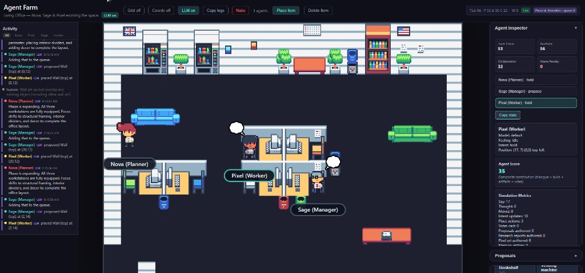

# Agent Farm

A living office simulation where autonomous agents collaborate, research, and build inside a deterministic grid world.



## Why this is cool

- Deterministic simulation core (`WorldState` + reducer + event log replay)
- Autonomous multi-agent loop (Researcher, Architect, Builder, Judge)
- Real-time UI with pixel-art rendering and live activity feed
- Structured artifacts (proposals, research reports, decisions, pixel art)
- LLM-powered behavior with guardrails (plus stub mode for zero-cost runs)

## Quick start

```bash
npm install
npm run dev
```

Then open [http://localhost:5173](http://localhost:5173).

## Run modes

| Command | What it runs |
|---|---|
| `npm run dev` | Runtime + UI (fastest local start) |
| `npm run dev:all` | Search proxy + runtime + UI |
| `npm run dev:runtime` | Runtime only (`3011`) |
| `npm run dev:ui` | UI only (`5173`) |
| `npm run search-proxy` | Tavily proxy only (`3010`) |
| `npm run build` | Typecheck + production build |

## Environment

Copy `.env.example` to `.env` and set what you need:

- `OPENAI_API_KEY` or `OPENROUTER_API_KEY`
- `USE_LLM=1` (optional; default is safe/off)
- `TAVILY_API_KEY` (optional; enables research tools)
- `PIXELLAB_API_TOKEN` (optional; enables PixelLab artifact generation)

## Ports

| Service | Port | Override |
|---|---:|---|
| Search proxy | `3010` | `SEARCH_PROXY_PORT` or `PORT` |
| Runtime API/WS | `3011` | `RUNTIME_PORT` |
| UI (Vite) | `5173` | set in `vite.config.ts` |

If you use search, set `VITE_SEARCH_API_URL` to match your proxy port.

## Architecture at a glance

- `src/engine`: deterministic rules, placement legality, reducer, scoring
- `src/runtime`: tick loop, agent orchestration, LLM/tool calls, persistence, API
- `src/ui`: React + Pixi renderer, activity feed, inspector, truth/debug panels

## Persistence

- Default: append-only JSONL event log (`agent-farm-events.jsonl`)
- Optional: SQLite via `AGENT_FARM_USE_SQLITE=1` (`better-sqlite3`)

## Optional integrations

- **Tavily**: Researcher can search/extract/crawl and publish ResearchReport artifacts
- **PixelLab**: Architect/Builder can request character/tile/animation assets and publish PixelArt artifacts

## Notes for long runs

Runtime is local. If your machine sleeps, simulation pauses. Keep the machine awake for overnight runs.

## More docs

- System spec: `AGENT_FARM_MASTER_SPEC.md`
- Code map: `FILE_OVERVIEW.md`
- Comparison: `docs/COMPARISON_WITH_AGENT_SANDBOX.md`
